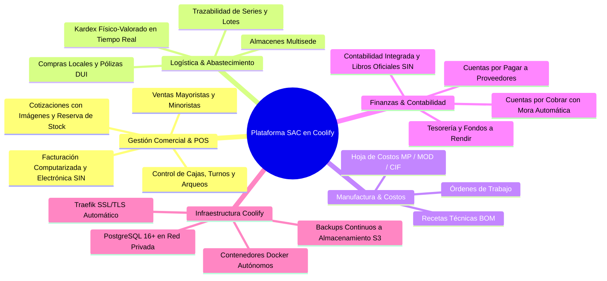
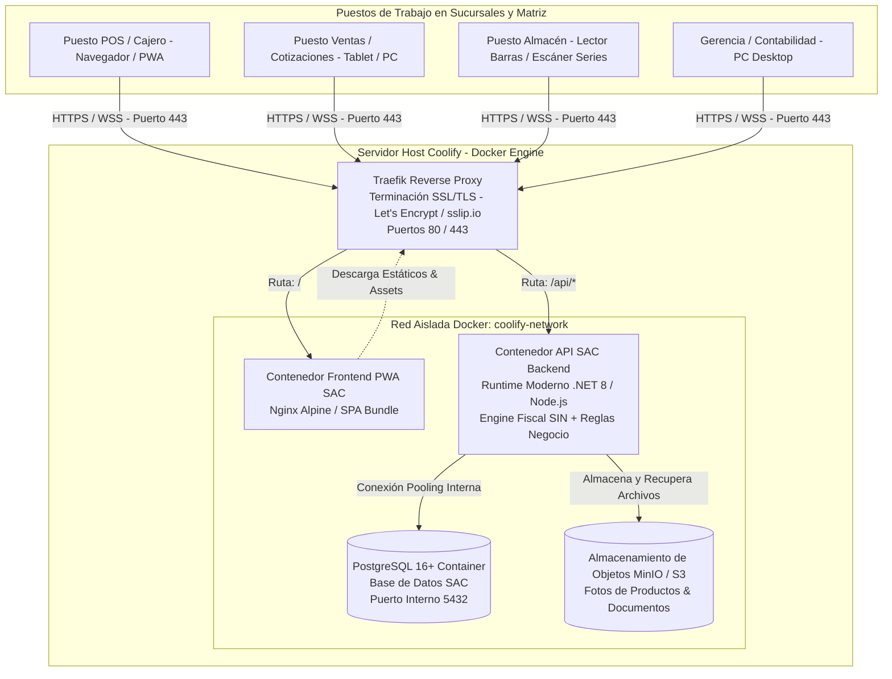
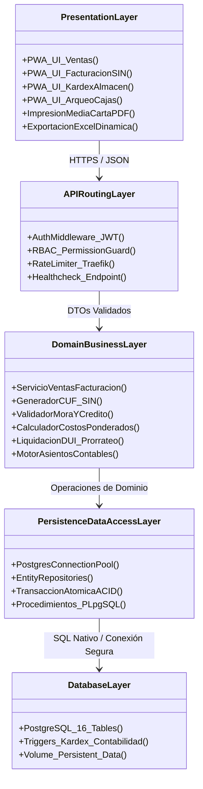
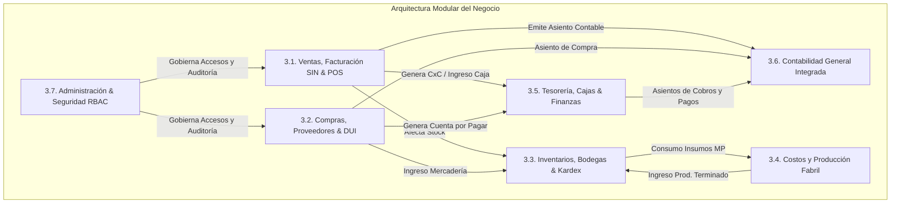
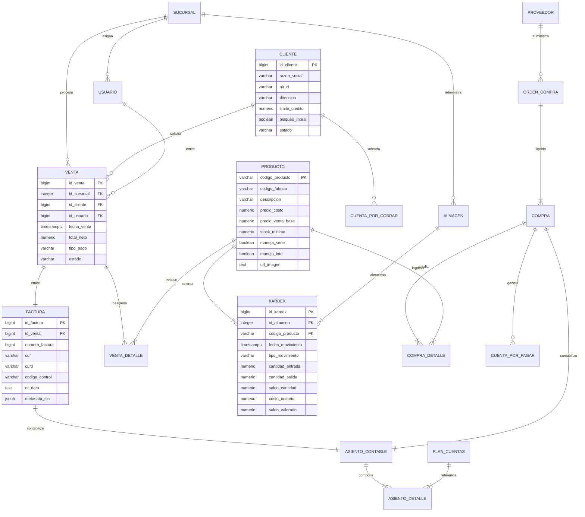
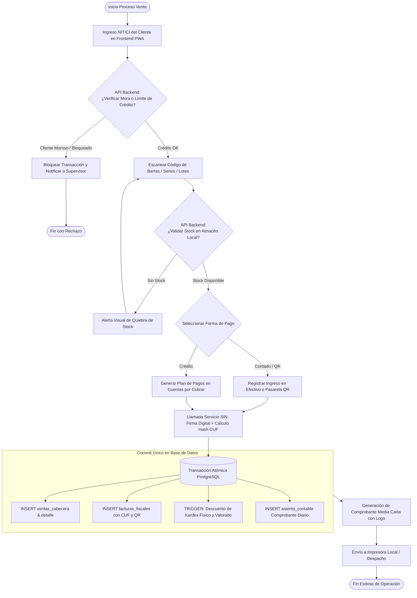
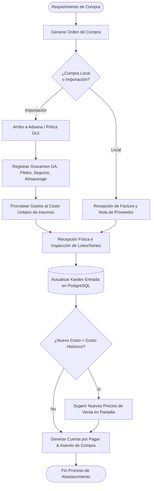
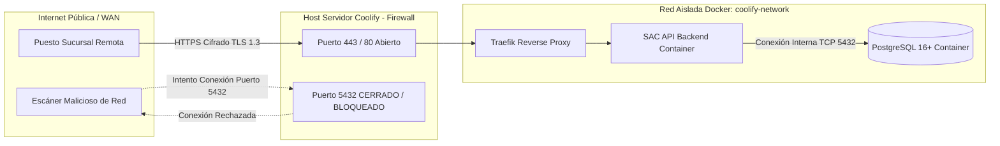
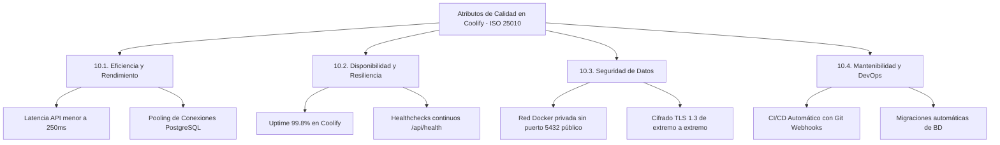
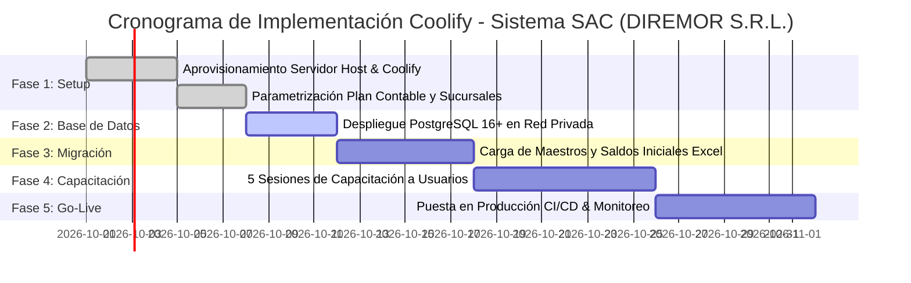

# DOCUMENTO DE DISEÑO DE SOFTWARE (SDD)
## SISTEMA EN LÍNEA DE GESTIÓN ADMINISTRATIVO COMERCIAL INTEGRADO A CONTABILIDAD (SAC)
### Modernización Arquitectónica y Despliegue en Plataforma Coolify PaaS (PostgreSQL + Contenedores)

---

**Organización Cliente:** DIREMOR S.R.L.  
**Proveedor Tecnológico:** GRUPO SP — Soluciones Informáticas para las Empresas  
**Plataforma de Despliegue:** Coolify PaaS (Self-Hosted / Docker Engine / Traefik Proxy)  
**Motor de Persistencia:** PostgreSQL 16+ (Servicio Gestionado en Coolify)  
**Referencia Técnica:** CITE GSP GC No. 176/2026 / Addendum Arquitectura Cloud  
**Documento:** Software Design Description (SDD)  
**Estándar de Referencia:** IEEE Std 1016-2009 / ISO/IEC/IEEE 42010 / ISO/IEC 25010  
**Versión:** 2.0 — Adaptación Integral a Ecosistema Coolify  
**Fecha de Emisión:** 23 de septiembre de 2026  
**Clasificación:** Confidencial / Ingeniería de Software Empresarial  

---

## CONTROL DE VERSIONES Y APROBACIONES

### Historial de Revisiones

| Versión | Fecha | Autor / Rol | Descripción del Cambio |
| :--- | :--- | :--- | :--- |
| 1.0 | 22/09/2026 | Arquitecto de Solución Grupo SP | Versión base sobre arquitectura propietaria cliente-servidor (Windows / Oracle XE / .NET 3.5). |
| 2.0 | 23/09/2026 | Arquitecto de Software Senior | **Modernización integral a plataforma Coolify:** Sustitución de Oracle DB por **PostgreSQL 16+**, desacoplamiento de capa monolítica a **Backend API REST/GraphQL containerizado**, frontend Web App PWA multi-sucursal con TLS/HTTPS automático vía **Traefik**, persistencia en red interna Docker aislada y backups programados hacia S3. |

### Matriz de Firmas y Validación

| Rol | Nombre | Firma / Estado |
| :--- | :--- | :--- |
| **Arquitecto de Software Senior** | Especialista en Arquitectura Cloud / DevOps | Aprobado |
| **Líder Técnico de Infraestructura** | Administrador de Plataforma Coolify | Conforme |
| **Gerente Comercial Grupo SP** | Mary Rielca Heredia L. | Conforme |
| **Responsable de TI (DIREMOR S.R.L.)** | Dirección de Sistemas | En Revisión |

---

## ÍNDICE GENERAL

1. [INTRODUCCIÓN](#1-introducción)  
   1.1. Propósito del Documento  
   1.2. Alcance del Sistema y Modernización  
   1.3. Justificación de la Migración Técnica (Oracle $\rightarrow$ PostgreSQL / On-Premise $\rightarrow$ Coolify)  
   1.4. Definiciones, Siglas y Abreviaturas  
   1.5. Referencias Normativas  
2. [ARQUITECTURA GENERAL DEL SISTEMA EN COOLIFY](#2-arquitectura-general-del-sistema-en-coolify)  
   2.1. Paradigma Arquitectónico de Micro-Servicios / API-First Containerizada  
   2.2. Descomposición por Capas Lógicas  
   2.3. Topología de Red y Enrutamiento con Traefik Reverse Proxy  
   2.4. Diagrama de Arquitectura Integral de Contenedores en Coolify  
3. [DISEÑO MODULAR DEL SISTEMA](#3-diseño-modular-del-sistema)  
   3.1. Módulo de Ventas, Facturación en Línea (SIN) y Puntos de Venta (POS)  
   3.2. Módulo de Compras, Importaciones y Liquidación DUI  
   3.3. Módulo de Inventarios, Multialmacenes y Trazabilidad (Series/Lotes)  
   3.4. Módulo de Costos y Producción Fabril (MP, MOD, CIF)  
   3.5. Módulo Financiero, Tesorería y Cobranzas  
   3.6. Módulo de Contabilidad General Integrada  
   3.7. Módulo de Administración, Seguridad RBAC y Configuración  
4. [DISEÑO DE BASE DE DATOS (POSTGRESQL 16+)](#4-diseño-de-base-de-datos-postgresql-16)  
   4.1. Filosofía de Persistencia en PostgreSQL y Motor Transaccional ACID  
   4.2. Modelo Conceptual Entidad-Relación (ERD)  
   4.3. Diccionario de Datos DDL (Sintaxis Nativa PostgreSQL)  
   4.4. Funciones Almacenadas en PL/pgSQL y Disparadores (Triggers) de Integridad  
   4.5. Estrategia de Índices B-Tree, Índices Compuestos y JSONB para Eventos Fiscales  
5. [DISEÑO DE PROCESOS PRINCIPALES DEL NEGOCIO](#5-diseño-de-procesos-principales-del-negocio)  
   5.1. Proceso Transaccional de Venta y Facturación Electrónica en Línea  
   5.2. Proceso de Abastecimiento, Compras y Liquidación de Importaciones (DUI)  
   5.3. Proceso de Turnos, Arqueo de Caja y Conciliación POS  
   5.4. Proceso de Fabricación y Absorción de Costos  
6. [DISEÑO DE INTERFACES DE USUARIO Y ERGONOMÍA (HMI/UI-UX)](#6-diseño-de-interfaces-de-usuario-y-ergonomía-hmiui-ux)  
   6.1. Principios de Diseño Centrado en el Usuario No Especialista  
   6.2. Arquitectura de Navegación Web Moderna (PWA / SPA) con Vistas Múltiples Concurrentes  
   6.3. Catálogo de Vistas y Formularios Críticos  
   6.4. Formato de Impresión Media Carta, Código QR y Generación de Documentos  
7. [SEGURIDAD, CONTROL DE ACCESO Y AUDITORÍA EN COOLIFY](#7-seguridad-control-de-acceso-y-auditoría-en-coolify)  
   7.1. Control de Acceso Basado en Roles (RBAC) y Autenticación JWT  
   7.2. Aislamiento de Red: Cero Exposición Pública de PostgreSQL  
   7.3. Cifrado TLS 1.3 de Extremo a Extremo con Let's Encrypt / FQDN  
   7.4. Políticas de Respaldo Automatizado hacia Almacenamiento de Objetos S3  
8. [INFRAESTRUCTURA TECNOLÓGICA Y DESPLIEGUE EN COOLIFY](#8-infraestructura-tecnológica-y-despliegue-en-coolify)  
   8.1. Especificaciones del Servidor Host Coolify (Docker Engine)  
   8.2. Definición del Despliegue con Docker Compose / Coolify Resource Stack  
   8.3. Variables de Entorno y Manejo Seguro de Secretos  
   8.4. Almacenamiento de Objetos para Fotografías de Productos (MinIO / S3)  
9. [MATRIZ DE INTEGRACIÓN E INTEROPERABILIDAD TRANSACCIONAL](#9-matriz-de-integración-e-interoperabilidad-transaccional)  
   9.1. Orquestación Atómica de Factura de Venta  
   9.2. Orquestación del Evento Recepción de Compras  
   9.3. Integración con Servicios Web del SIN (RND 102100000011)  
10. [REQUERIMIENTOS NO FUNCIONALES (ISO/IEC 25010)](#10-requerimientos-no-funcionales-isoiec-25010)  
    10.1. Rendimiento y Latencia Optimizada  
    10.2. Alta Disponibilidad, Healthchecks (`/api/health`) y Recuperación Automática  
    10.3. Integridad y Concurrencia Multiversión (MVCC)  
    10.4. Escalabilidad Horizontal y Vertical  
11. [PLAN Y METODOLOGÍA DE IMPLEMENTACIÓN CON CI/CD EN COOLIFY](#11-plan-y-metodología-de-implementación-con-cicd-en-coolify)  
    11.1. Etapas Secuenciales de Puesta en Marcha  
    11.2. Pipeline de Pre-Deployment y Migraciones Automatizadas de Base de Datos  
    11.3. Migración y Cuadre de Saldos Iniciales  
    11.4. Programa de Capacitación Operativa  
12. [CONCLUSIONES Y RECOMENDACIONES TÉCNICAS](#12-conclusiones-y-recomendaciones-técnicas)  

---

## 1. INTRODUCCIÓN

### 1.1. Propósito del Documento
El presente **Documento de Diseño de Software (SDD)** tiene como finalidad definir de manera rigurosa y formal la arquitectura técnica, diseño de componentes, modelo de datos y topología de despliegue del **Sistema en Línea de Gestión Administrativo Comercial integrado a Contabilidad (SAC)** para la empresa **DIREMOR S.R.L.**, adaptándolo completamente al ecosistema moderno de infraestructura **Coolify PaaS**.

Este documento adapta la propuesta técnica original (CITE GSP GC No. 176/2026) a los estándares de ingeniería de software basados en contenedores, sustituyendo componentes monolíticos y gestores de bases de datos propietarios de alta fricción de licenciamiento (como Oracle Database XE) por tecnologías open-source empresariales como **PostgreSQL 16+**, garantizando alta disponibilidad, escalabilidad elástica y reducción total de costos ocultos de infraestructura.

### 1.2. Alcance del Sistema y Modernización
El sistema SAC cubre la totalidad de los procesos administrativos, comerciales, financieros y contables de DIREMOR S.R.L., interconectando la Casa Matriz con todas las sucursales remotas en tiempo real:



### 1.3. Justificación de la Migración Técnica (Oracle $\rightarrow$ PostgreSQL / On-Premise $\rightarrow$ Coolify)
La propuesta original contemplaba una topología tradicional basada en estaciones con cliente pesado Visual .NET 3.5 conectadas de forma remota a una base de datos Oracle Database Express Edition (XE) sobre Windows 10 Pro, exponiendo el puerto TCP 1521 vía IP pública o requiriendo túneles VPN manuales.

La adopción de **Coolify PaaS** y **PostgreSQL 16+** aporta mejoras determinantes en la ingeniería del sistema:

| Criterio Técnico | Propuesta Original (Legacy) | Arquitectura Adaptada a Coolify | Beneficio para DIREMOR S.R.L. |
| :--- | :--- | :--- | :--- |
| **Motor de Base de Datos** | Oracle Database XE (Límite 12 GB disco, 2 GB RAM, 2 CPU). | **PostgreSQL 16+** (Sin restricciones artificiales de RAM, CPU o tamaño de BD). | Cero coste de licencias, soporte nativo JSONB, rendimiento ilimitado y alta portabilidad. |
| **Capa de Conectividad** | Puerto 1521 expuesto en router o VPN cliente individual. | **Red interna Docker privada (`coolify-network`)**. Base de datos aislada sin exposición externa. | Eliminación de vectores de ataque. Solo el API backend se expone mediante HTTPS. |
| **Enrutamiento y TLS** | Gestión manual de certificados y mapeo de puertos NAT. | **Traefik Reverse Proxy** integrado con provisión automática de certificados SSL/TLS (Let's Encrypt / sslip.io). | Conexiones 100% cifradas, renovación automática de certificados sin interrupción. |
| **Capa de Clientes** | Instalación manual de ejecutables WinForms + .NET 3.5 en cada PC. | **Web Application PWA responsiva** accesible desde navegadores modernos en cualquier dispositivo. | Despliegue instantáneo en sucursales sin configuración local de puestos. |
| **Almacenamiento de Fotos** | Rutas compartidas de red de Windows (`\\server\shared`). | **Almacenamiento de Objetos S3 / MinIO** o volúmenes Docker montados. | Acceso ultra-rápido a fotografías de productos con URLs optimizadas y caching. |
| **Despliegue y Ciclo de Vida** | Instalador manual equipo por equipo. | **CI/CD automatizado vía Coolify**: git push $\rightarrow$ build $\rightarrow$ pre-deploy migrations $\rightarrow$ healthcheck. | Actualizaciones continuas sin paradas de servicio ni soporte presencial costoso. |

### 1.4. Definiciones, Siglas y Abreviaturas
* **PaaS:** Platform as a Service (Plataforma como Servicio).
* **PWA:** Progressive Web Application (Aplicación Web Progresiva).
* **FQDN:** Fully Qualified Domain Name (Nombre de Dominio Completamente Calificado).
* **MVCC:** Multi-Version Concurrency Control (Control de Concurrencia Multiversión de PostgreSQL).
* **CUF / CUFD:** Código Único de Facturación / Código Único de Facturación Diaria (SIN Bolivia).
* **DUI:** Documento Único de Importación (Aduana Nacional de Bolivia).
* **RND:** Resolución Normativa de Directorio (Servicio de Impuestos Nacionales).

### 1.5. Referencias Normativas
* **RND 102100000011 (11/08/2021):** Sistema de Facturación del Servicio de Impuestos Nacionales (SIN).
* **Estándar IEEE 1016-2009:** Software Design Descriptions.
* **ISO/IEC 25010:** Modelo de Calidad del Producto de Software.

---

## 2. ARQUITECTURA GENERAL DEL SISTEMA EN COOLIFY

### 2.1. Paradigma Arquitectónico de Micro-Servicios / API-First Containerizada
El sistema SAC se diseña bajo un patrón arquitectónico **API-First desacoplado**, compuesto por servicios containerizados gestionados por **Coolify**. Se erradica la dependencia de clientes pesados de escritorio dependientes de DLLs locales para pasar a una arquitectura donde el cliente consume una API RESTful / WebSocket robusta y autenticada mediante tokens criptográficos JWT.



### 2.2. Descomposición por Capas Lógicas



### 2.3. Topología de Red y Enrutamiento con Traefik Reverse Proxy
* **Control de Ingress:** Todo el tráfico HTTP/HTTPS es interceptado por **Traefik**, el proxy inverso nativo de Coolify.
* **Cifrado Obligatorio:** Redirección automática de HTTP (puerto 80) a HTTPS (puerto 443) con protocolo TLS 1.3.
* **Asignación de Dominios:**
  * Dominio Principal de la Aplicación: `https://sac.diremor.com` o FQDN wildcard autogenerado por Coolify (`https://sac.<IP>.sslip.io`).
  * Endpoint de API Backend: `https://sac.diremor.com/api`
  * Monitoreo y Healthchecks: `https://sac.diremor.com/api/health`

---

## 3. DISEÑO MODULAR DEL SISTEMA

Los siete módulos funcionales de la propuesta original de GRUPO SP han sido completamente preservados y potenciados para operar sobre **PostgreSQL 16+**.



---

### 3.1. Módulo de Ventas, Facturación en Línea (SIN) y Puntos de Venta (POS)
* **Padrón de Clientes:** Clasificación en listas de precios (Minorista, Mayorista, Especial), zonificación y asignación de límites de crédito.
* **Cotizaciones con Reserva e Imágenes:** Generación de proformas con fotos servidas en alta velocidad desde el almacenamiento de objetos S3; bloqueo de stock temporal para evitar ventas duplicadas.
* **Cumplimiento Tributario SIN (RND 102100000011):**
  * Facturación Computarizada en Línea y Electrónica en Línea.
  * Generación y firmado de documentos con cálculo de hash **SHA-256** para el Código Único de Facturación (**CUF**), Código Único de Facturación Diaria (**CUFD**), Código de Control y generación vectorial de códigos **QR**.
  * Soporte de Facturas Estándar, Facturas de Exportación, Tasa Cero IVA, Alquileres y Servicios.
* **Puntos de Venta (POS):**
  * Turnos por cajero, arqueos ciegos, registro de ventas rápidas con teclado numérico o lector de código de barras.
  * Trazabilidad de número de serie por cada artículo vendido y control de vencimiento/lote.

---

### 3.2. Módulo de Compras, Importaciones y Liquidación DUI
* **Gestión de Proveedores y Órdenes de Compra:** Circuito completo desde requisición interna hasta la formalización de la orden.
* **Importaciones y Pólizas DUI:**
  * Registro de póliza DUI, gastos de agencia aduanera, aranceles Gravamen Arancelario (GA), seguros y fletes terrestres/marítimos.
  * Prorrateo automático de los costos de importación para determinar el costo unitario de internación real en bodega.
* **Recuperación de Costo de Última Compra y Reprecio:** Si el costo de adquisición de un ítem se eleva, el sistema calcula y sugiere automáticamente nuevos precios de venta para salvaguardar el margen bruto comercial configurado.

---

### 3.3. Módulo de Inventarios, Multialmacenes y Trazabilidad (Series/Lotes)
* **Kardex Físico-Valorado en Tiempo Real:** Método de Promedio Ponderado Móvil o PEPS/FIFO garantizado mediante transacciones atómicas en PostgreSQL.
* **Multialmacén y Traspasos:** Traslados entre bodegas con verificación de salida y recepción confirmada en destino.
* **Trazabilidad Farmacéutica e Industrial:** Control estricto de números de serie para garantías y lotes con fecha de vencimiento, bloqueando el despacho de productos caducados.
* **Salidas por Centro de Costo, Mermas y Tomas de Inventario:** Recuento físico periódico y ajustes directos por sobrantes/faltantes.

---

### 3.4. Módulo de Costos y Producción Fabril (MP, MOD, CIF)
* **Fórmulas y Recetas (BOM):** Definición de insumos necesarios para la fabricación de productos terminados.
* **Hoja de Costos:**
  * **Materia Prima (MP):** Descargo valorado automático del kardex de insumos.
  * **Mano de Obra Directa (MOD):** Imputación de horas hombre y costos por operario.
  * **Costos Indirectos de Fabricación (CIF):** Cuotas de absorción energética y depreciación.
* **Reportes Especializados:** Estado de Costo de Producción y Estado de Costo de lo Vendido.

---

### 3.5. Módulo Financiero, Tesorería y Cobranzas
* **Cuentas por Cobrar (CxC):** Clasificación por **antigüedad de saldos** (corriente, 30, 60, 90+ días) y **bloqueo automático** de ventas a clientes morosos.
* **Cuentas por Pagar (CxP):** Programación de pagos a proveedores y control de vencimientos.
* **Manejo del Disponible:** Cuentas corrientes bancarias, cajas chicas, depósitos bancarios, arqueos y **fondos a rendir** con rendición de cuentas y descargos.

---

### 3.6. Módulo de Contabilidad General Integrada
* **Automatización del Asiento Contable:** Cada factura de venta, nota de compra o movimiento de almacén genera de forma síncrona el comprobante de diario (Ingreso, Egreso, Traspaso) en PostgreSQL.
* **Libros Fiscales Oficiales:** Libro de Compras IVA y Libro de Ventas IVA con exportación conforme a formatos normativos del SIN.
* **Estados Financieros en Línea:** Balance General, Estado de Resultados y Balance de Sumas y Saldos a cualquier fecha de corte.

---

### 3.7. Módulo de Administración, Seguridad RBAC y Configuración
* **Gestión de Sedes y Sucursales:** Parámetros de dosificación fiscal por sucursal.
* **Cierre de Meses:** Bloqueo de periodos cerrados para evitar manipulaciones contables retrospectivas.
* **Impresión Estandarizada:** Plantillas de comprobantes en tamaño **media carta con logotipo corporativo** de DIREMOR S.R.L.

---

## 4. DISEÑO DE BASE DE DATOS (POSTGRESQL 16+)

### 4.1. Filosofía de Persistencia en PostgreSQL y Motor Transaccional ACID
La base de datos se implementa en **PostgreSQL 16+**, aprovechando su aislamiento de transacciones MVCC, integridad referencial estricta, tipos de datos avanzados y motor de extensiones. Se aloja como un servicio de base de datos nativo dentro del entorno Coolify, conectado a un volumen persistente de alta velocidad en el sistema de archivos del servidor.

### 4.2. Modelo Conceptual Entidad-Relación (ERD)



### 4.3. Diccionario de Datos DDL (Sintaxis Nativa PostgreSQL)

A continuación se detalla la definición formal DDL para las tablas principales:

```sql
-- Extensión para generación de UUIDs y funciones criptográficas
CREATE EXTENSION IF NOT EXISTS "pgcrypto";

-- 1. Tabla de Clientes
CREATE TABLE clientes (
    id_cliente BIGINT GENERATED ALWAYS AS IDENTITY PRIMARY KEY,
    razon_social VARCHAR(150) NOT NULL,
    tipo_documento VARCHAR(10) NOT NULL DEFAULT 'NIT',
    nit_ci VARCHAR(25) NOT NULL,
    direccion VARCHAR(200),
    telefono VARCHAR(30),
    zona VARCHAR(50),
    limite_credito NUMERIC(14,2) NOT NULL DEFAULT 0.00,
    bloqueo_mora BOOLEAN NOT NULL DEFAULT FALSE,
    estado VARCHAR(10) NOT NULL DEFAULT 'ACTIVO',
    created_at TIMESTAMPTZ NOT NULL DEFAULT CURRENT_TIMESTAMP,
    updated_at TIMESTAMPTZ NOT NULL DEFAULT CURRENT_TIMESTAMP,
    CONSTRAINT chk_clientes_limite CHECK (limite_credito >= 0)
);

CREATE INDEX idx_clientes_nit ON clientes(nit_ci);
CREATE INDEX idx_clientes_mora ON clientes(bloqueo_mora) WHERE bloqueo_mora = TRUE;

-- 2. Tabla de Catálogo de Productos
CREATE TABLE productos (
    codigo_producto VARCHAR(30) PRIMARY KEY,
    codigo_fabrica VARCHAR(50),
    descripcion VARCHAR(250) NOT NULL,
    categoria_id INTEGER NOT NULL,
    unidad_medida VARCHAR(20) NOT NULL DEFAULT 'PZA',
    peso_kg NUMERIC(10,3) DEFAULT 0.000,
    precio_costo NUMERIC(14,4) NOT NULL DEFAULT 0.0000,
    precio_venta_base NUMERIC(14,4) NOT NULL DEFAULT 0.0000,
    precio_venta_mayorista NUMERIC(14,4),
    stock_minimo NUMERIC(10,2) NOT NULL DEFAULT 0.00,
    stock_maximo NUMERIC(10,2) NOT NULL DEFAULT 0.00,
    maneja_serie BOOLEAN NOT NULL DEFAULT FALSE,
    maneja_lote BOOLEAN NOT NULL DEFAULT FALSE,
    url_imagen TEXT,
    activo BOOLEAN NOT NULL DEFAULT TRUE,
    created_at TIMESTAMPTZ NOT NULL DEFAULT CURRENT_TIMESTAMP
);

CREATE INDEX idx_productos_fabrica ON productos(codigo_fabrica);
CREATE INDEX idx_productos_categoria ON productos(categoria_id);

-- 3. Tabla de Ventas (Cabecera)
CREATE TABLE ventas_cabecera (
    id_venta BIGINT GENERATED ALWAYS AS IDENTITY PRIMARY KEY,
    id_sucursal INTEGER NOT NULL,
    id_cliente BIGINT NOT NULL REFERENCES clientes(id_cliente),
    id_usuario BIGINT NOT NULL,
    fecha_venta TIMESTAMPTZ NOT NULL DEFAULT CURRENT_TIMESTAMP,
    total_bruto NUMERIC(14,2) NOT NULL,
    descuento NUMERIC(14,2) NOT NULL DEFAULT 0.00,
    total_neto NUMERIC(14,2) NOT NULL,
    tipo_pago VARCHAR(20) NOT NULL, -- 'CONTADO', 'CREDITO', 'QR'
    estado VARCHAR(20) NOT NULL DEFAULT 'EMITIDA',
    observaciones TEXT,
    CONSTRAINT chk_venta_totales CHECK (total_neto >= 0)
);

CREATE INDEX idx_ventas_sucursal_fecha ON ventas_cabecera(id_sucursal, fecha_venta);
CREATE INDEX idx_ventas_cliente ON ventas_cabecera(id_cliente);

-- 4. Tabla de Facturas Fiscales (Integración SIN)
CREATE TABLE facturas_fiscales (
    id_factura BIGINT GENERATED ALWAYS AS IDENTITY PRIMARY KEY,
    id_venta BIGINT NOT NULL UNIQUE REFERENCES ventas_cabecera(id_venta) ON DELETE RESTRICT,
    numero_factura BIGINT NOT NULL,
    cuf VARCHAR(120) NOT NULL UNIQUE,
    cufd VARCHAR(120) NOT NULL,
    codigo_control VARCHAR(30),
    qr_data TEXT NOT NULL,
    estado_sin VARCHAR(20) NOT NULL DEFAULT 'VALIDA', -- 'VALIDA', 'ANULADA'
    fecha_emision TIMESTAMPTZ NOT NULL DEFAULT CURRENT_TIMESTAMP,
    metadata_sin JSONB
);

CREATE INDEX idx_facturas_cuf ON facturas_fiscales(cuf);
CREATE INDEX idx_facturas_numero ON facturas_fiscales(numero_factura);

-- 5. Tabla de Kardex de Inventarios (Transaccional)
CREATE TABLE kardex_movimientos (
    id_kardex BIGINT GENERATED ALWAYS AS IDENTITY PRIMARY KEY,
    id_almacen INTEGER NOT NULL,
    codigo_producto VARCHAR(30) NOT NULL REFERENCES productos(codigo_producto),
    fecha_movimiento TIMESTAMPTZ NOT NULL DEFAULT CURRENT_TIMESTAMP,
    tipo_movimiento VARCHAR(25) NOT NULL, -- 'VENTA', 'COMPRA', 'TRASPASO', 'AJUSTE', 'PRODUCCION'
    id_documento_ref BIGINT NOT NULL,
    cantidad_entrada NUMERIC(12,2) NOT NULL DEFAULT 0.00,
    cantidad_salida NUMERIC(12,2) NOT NULL DEFAULT 0.00,
    saldo_cantidad NUMERIC(12,2) NOT NULL,
    costo_unitario NUMERIC(14,4) NOT NULL,
    saldo_valorado NUMERIC(16,4) NOT NULL,
    numero_serie VARCHAR(50),
    numero_lote VARCHAR(50),
    fecha_vencimiento DATE
);

CREATE INDEX idx_kardex_prod_alm ON kardex_movimientos(codigo_producto, id_almacen);
CREATE INDEX idx_kardex_fecha ON kardex_movimientos(fecha_movimiento);
```

### 4.4. Funciones Almacenadas en PL/pgSQL y Disparadores (Triggers) de Integridad
Para garantizar la atomicidad que la propuesta comercial exige (donde una venta impacta sincrónicamente ventas, kardex y contabilidad), se implementa una función en **PL/pgSQL**:

```sql
CREATE OR REPLACE FUNCTION fn_registrar_salida_kardex_venta()
RETURNS TRIGGER AS $$
DECLARE
    v_stock_actual NUMERIC(12,2);
    v_costo_actual NUMERIC(14,4);
    v_nuevo_stock NUMERIC(12,2);
BEGIN
    -- Bloqueo de fila para evitar condiciones de carrera en ventas concurrentes
    SELECT saldo_cantidad, costo_unitario 
    INTO v_stock_actual, v_costo_actual
    FROM kardex_movimientos
    WHERE codigo_producto = NEW.codigo_producto AND id_almacen = NEW.id_almacen
    ORDER BY id_kardex DESC
    LIMIT 1
    FOR UPDATE;

    IF v_stock_actual IS NULL OR v_stock_actual < NEW.cantidad THEN
        RAISE EXCEPTION 'Stock insuficiente para el producto % en el almacén %', 
            NEW.codigo_producto, NEW.id_almacen;
    END IF;

    v_nuevo_stock := v_stock_actual - NEW.cantidad;

    INSERT INTO kardex_movimientos (
        id_almacen, codigo_producto, tipo_movimiento, id_documento_ref,
        cantidad_salida, saldo_cantidad, costo_unitario, saldo_valorado,
        numero_serie, numero_lote
    ) VALUES (
        NEW.id_almacen, NEW.codigo_producto, 'VENTA', NEW.id_venta,
        NEW.cantidad, v_nuevo_stock, v_costo_actual, (v_nuevo_stock * v_costo_actual),
        NEW.numero_serie, NEW.numero_lote
    );

    RETURN NEW;
END;
$$ LANGUAGE plpgsql;
```

---

## 5. DISEÑO DE PROCESOS PRINCIPALES DEL NEGOCIO

### 5.1. Proceso Transaccional de Venta y Facturación Electrónica en Línea
El flujo operativo integra la validación de clientes, control de mora y emisión fiscal mediante llamadas protegidas entre el cliente Web y la API en Coolify.



### 5.2. Proceso de Abastecimiento, Compras y Liquidación de Importaciones (DUI)



---

## 6. DISEÑO DE INTERFACES DE USUARIO Y ERGONOMÍA (HMI/UI-UX)

### 6.1. Principios de Diseño Centrado en el Usuario No Especialista
Dado que el sistema debe ser operado ágilmente por usuarios sin conocimientos técnicos avanzados, la interfaz Web (PWA) respeta estrictamente los principios de usabilidad ergonómica:
* **Entrada sin Ratón para Alta Velocidad:** Atajos de teclado completos (`F2` para buscar cliente, `F4` para buscar producto, `F10` para cobrar e imprimir) que emulan la inmediatez de las aplicaciones de escritorio tradicionales pero con la ubicuidad de la Web.
* **Confirmaciones No Intrusivas:** Notificaciones visuales tipo *toast* flotantes sin bloquear el flujo de trabajo del cajero.
* **Previsualización de Fotos en Alta Definición:** Al ingresar o buscar un producto, el sistema despliega de inmediato la fotografía del artículo para certificar el despacho físico correcto.

### 6.2. Arquitectura de Navegación Web Moderna (PWA / SPA) con Vistas Múltiples
Para satisfacer el requisito clave de la propuesta original (*"pueden visualizarse varias ventanas y módulos a la vez sin necesidad de cerrar las consultas"*), el frontend incorpora un **gestor de pestañas internas concurrentes (Virtual MDI)**. Un operador puede alternar entre la emisión de una factura, la consulta del estado de cuenta de un cliente y la revisión de stock sin perder datos en edición ni recargar la página.

### 6.3. Catálogo de Vistas Críticas
1. **Consola POS / Facturación Rápida:** Optimizada para monitores táctiles o teclado rápido, con cálculo inmediato de cambio/vuelto y selector de medio de pago.
2. **Tablero de Control de Antigüedad de Saldos (CxC):** Gráfico interactivo y tabla con semaforización de mora comercial para el área de créditos.
3. **Explorador Visual de Almacenes y Kardex:** Filtros por familia, bodega, sucursal, número de lote o serie, con opción de exportación instantánea a Excel.

### 6.4. Formato de Impresión Media Carta, Código QR y Generación de Documentos
* **Formato Media Carta (Half-Letter):** Todas las facturas y comprobantes se procesan mediante un motor de renderizado vectorial PDF nativo con las dimensiones exactas de papel media carta, incluyendo el logotipo oficial de DIREMOR S.R.L., datos de dosificación, CUF y código QR reglamentario del SIN.

---

## 7. SEGURIDAD, CONTROL DE ACCESO Y AUDITORÍA EN COOLIFY

### 7.1. Control de Acceso Basado en Roles (RBAC) y Autenticación JWT
* **Tokens Criptográficos:** Los usuarios inician sesión y reciben un token **JWT (JSON Web Token)** firmado con algoritmo HMAC-SHA256, con expiración programada y refresh token seguro.
* **Matriz de Permisos:** Restricción granular a nivel de endpoint API y opciones visuales de menú según el rol asignado (`Administrador`, `Ventas/POS`, `Almacén`, `Contabilidad`, `Gerencia`).

### 7.2. Aislamiento de Red: Cero Exposición Pública de PostgreSQL
En la arquitectura adaptada a Coolify, **el puerto 5432 de PostgreSQL no se expone a internet**. 
* Toda la comunicación ocurre estrictamente dentro del puente de red privado de Docker (`coolify-network`).
* Ni hackers ni escáneres de puertos externos pueden conectarse directamente al motor de base de datos.
* Solo el contenedor de la API SAC tiene acceso autenticado a la base de datos mediante la variable interna `DATABASE_URL`.



### 7.3. Cifrado TLS 1.3 de Extremo a Extremo con Let's Encrypt / FQDN
* **Certificados SSL Automáticos:** Traefik gestiona la emisión y renovación automática de certificados Let's Encrypt para el dominio corporativo asignado, garantizando que todo dato en tránsito viaje bajo TLS 1.3 con cifrado fuerte.

### 7.4. Políticas de Respaldo Automatizado hacia Almacenamiento de Objetos S3
* **Backups Programados en Coolify:** Coolify ejecuta volcados automáticos periódicos (`pg_dump` con compresión) de la base de datos PostgreSQL.
* **Destino Externo:** Los respaldos se envían cifrados vía protocolo S3 a un almacenamiento externo seguro (Bucket S3 o MinIO independiente), asegurando un RPO (*Recovery Point Objective*) menor a 12 horas sin intervención humana.

---

## 8. INFRAESTRUCTURA TECNOLÓGICA Y DESPLIEGUE EN COOLIFY

### 8.1. Especificaciones del Servidor Host Coolify (Docker Engine)
Para soportar la carga concurrente de DIREMOR S.R.L. con sus sucursales, el servidor host (VPS o Servidor Dedicado con Linux) debe cumplir los siguientes requerimientos:

| Recurso | Especificación Mínima | Especificación Recomendada (Alta Carga) |
| :--- | :--- | :--- |
| **Sistema Operativo** | Ubuntu Server 22.04 / 24.04 LTS (64-bit) | Debian 12 / Ubuntu Server 24.04 LTS |
| **Plataforma Orquestación** | Coolify v4+ / Docker Engine 26+ | Coolify v4+ / Docker Compose v2 |
| **Procesador (CPU)** | 4 vCPU (Intel Xeon / AMD EPYC) | 8 vCPU dedicados |
| **Memoria RAM** | 8 GB RAM | 16 GB a 32 GB RAM DDR4/DDR5 |
| **Almacenamiento** | 100 GB SSD NVMe (I/O intensivo) | 250 GB+ SSD NVMe en RAID 1 |
| **Ancho de Banda** | 100 Mbps simétrico con IP Pública Fija | 1 Gbps simétrico |

### 8.2. Definición del Despliegue con Docker Compose / Coolify Resource Stack
La infraestructura completa se define formalmente en un archivo declarativo `docker-compose.yml` gestionado por Coolify:

```yaml
version: '3.8'

services:
  # Base de Datos Relacional PostgreSQL 16
  sac-database:
    image: postgres:16-alpine
    container_name: sac-postgres
    restart: always
    environment:
      POSTGRES_DB: ${POSTGRES_DB:-sac_diremor}
      POSTGRES_USER: ${POSTGRES_USER:-sac_admin}
      POSTGRES_PASSWORD: ${POSTGRES_PASSWORD}
    volumes:
      - postgres_data:/var/lib/postgresql/data
    networks:
      - coolify-network
    healthcheck:
      test: ["CMD-SHELL", "pg_isready -U ${POSTGRES_USER:-sac_admin} -d ${POSTGRES_DB:-sac_diremor}"]
      interval: 10s
      timeout: 5s
      retries: 5

  # Backend API - Reglas de Negocio y Facturación SIN
  sac-api:
    build:
      context: .
      dockerfile: Dockerfile.api
    container_name: sac-api
    restart: always
    depends_on:
      sac-database:
        condition: service_healthy
    environment:
      DATABASE_URL: postgresql://${POSTGRES_USER:-sac_admin}:${POSTGRES_PASSWORD}@sac-database:5432/${POSTGRES_DB:-sac_diremor}
      JWT_SECRET: ${JWT_SECRET}
      SIN_MODALIDAD: ${SIN_MODALIDAD:-ELECTRONICA_EN_LINEA}
      SIN_API_KEY: ${SIN_API_KEY}
    networks:
      - coolify-network
    labels:
      - "traefik.enable=true"
      - "traefik.http.routers.sac-api.rule=Host(`${APP_DOMAIN}`) && PathPrefix(`/api`)"
      - "traefik.http.routers.sac-api.entrypoints=websecure"
      - "traefik.http.routers.sac-api.tls.certresolver=letsencrypt"

  # Frontend Web App (PWA)
  sac-frontend:
    build:
      context: .
      dockerfile: Dockerfile.web
    container_name: sac-frontend
    restart: always
    depends_on:
      - sac-api
    networks:
      - coolify-network
    labels:
      - "traefik.enable=true"
      - "traefik.http.routers.sac-ui.rule=Host(`${APP_DOMAIN}`)"
      - "traefik.http.routers.sac-ui.entrypoints=websecure"
      - "traefik.http.routers.sac-ui.tls.certresolver=letsencrypt"

volumes:
  postgres_data:
    driver: local

networks:
  coolify-network:
    external: true
```

### 8.3. Variables de Entorno y Manejo Seguro de Secretos
Siguiendo los lineamientos de seguridad de Coolify, los secretos nunca se almacenan en código fuente:
* `DATABASE_URL`: Inyectada automáticamente entre contenedores.
* `JWT_SECRET`: Cadena aleatoria de 64 bytes para firma de sesiones.
* `SIN_CERT_PASS`: Clave de protección del certificado digital para emisión tributaria.

---

## 9. MATRIZ DE INTEGRACIÓN E INTEROPERABILIDAD TRANSACCIONAL

### 9.1. Orquestación Atómica de Factura de Venta
La operación de venta se ejecuta como una **transacción atómica en PostgreSQL**:

$$\begin{array}{|l|l|l|}
\hline
\textbf{Paso} & \textbf{Componente Afectado} & \textbf{Acción Transaccional Síncrona} \\ \hline
1 & \text{Catálogo / Límites} & \text{Verificación de crédito de cliente y no existencia de mora.} \\ \hline
2 & \text{Kardex Inventarios} & \text{Descuento de unidades e imputación de costo ponderado de salida.} \\ \hline
3 & \text{Cuentas por Cobrar / Caja} & \text{Asiento del valor monetario en cartera exigible o efectivo POS.} \\ \hline
4 & \text{Servicio Fiscal SIN} & \text{Firma y registro del CUF/QR en el Libro de Ventas IVA Oficial.} \\ \hline
5 & \text{Contabilidad General} & \text{Generación automática del asiento de diario: Ventas, Débito Fiscal e IT.} \\ \hline
\end{array}$$

Cualquier excepción o error en uno de los pasos dispara un `ROLLBACK` total, asegurando la consistencia estricta del sistema.

### 9.2. Orquestación del Evento Recepción de Compras
1. Se valida el ingreso físico contra la orden de compra.
2. Se actualiza el kardex con nuevo saldo y recálculo del costo promedio ponderado.
3. Se genera la cuenta por pagar contra el proveedor indexada a su vencimiento.
4. Se alimenta el Libro de Compras IVA para el descargo tributario mensual.
5. Se confecciona el comprobante de diario contable de egreso o traspaso.

---

## 10. REQUERIMIENTOS NO FUNCIONALES (ISO/IEC 25010)



### 10.1. Rendimiento y Latencia Optimizada
* Tiempos de respuesta para transacciones comerciales habituales inferiores a **250 milisegundos**.
* Conexiones pooling eficientes en PostgreSQL para admitir decenas de terminales POS concurrentes sin sobrecarga de memoria en el servidor host.

### 10.2. Alta Disponibilidad y Healthchecks (`/api/health`)
* Coolify supervisa constantemente el estado del contenedor a través de su endpoint `/api/health`. Ante una falla no recuperada o saturación, el orquestador reinicia el contenedor de forma automática en cuestión de segundos.

### 10.3. Integridad y Concurrencia Multiversión (MVCC)
* PostgreSQL aísla las lecturas y escrituras evitando que consultas complejas de balances contables o reportes pesados de auditoría bloqueen la facturación ágil de los cajeros en las sucursales.

---

## 11. PLAN Y METODOLOGÍA DE IMPLEMENTACIÓN CON CI/CD EN COOLIFY

El cronograma técnico se distribuye en **cinco etapas de despliegue continuo**:



### 11.1. Pipeline de Pre-Deployment y Migraciones Automatizadas
Cada actualización del sistema se realiza sin fricción técnica mediante el pipeline de Coolify:
1. **Push a Repositorio Git:** El equipo sube cambios validados a la rama principal.
2. **Pre-Deployment Command:** Coolify ejecuta las migraciones DDL en PostgreSQL (`npm run db:migrate` o `dotnet ef database update`).
3. **Build & Healthcheck:** Se construye la nueva imagen Docker y se verifica el endpoint `/api/health`.
4. **Zero-Downtime Swap:** Traefik conmuta el tráfico hacia el nuevo contenedor sin interrupción del servicio para los cajeros.

### 11.2. Protocolo de Capacitación Operativa
Se mantienen las **cinco (5) sesiones de capacitación** contempladas en la propuesta comercial (1 hora y 30 minutos c/u) enfocadas en la nueva interfaz Web/PWA:
* **Sesión 1:** Administración de Catálogos (Clientes, Proveedores, Artículos con fotos e imágenes).
* **Sesión 2:** Gestión de Almacenes, Kardex y Traspasos entre Sucursales.
* **Sesión 3:** Facturación en Línea (SIN), Puntos de Venta (POS) y Arqueo de Cajas.
* **Sesión 4:** Compras locales, Importaciones con liquidación DUI y Cuentas por Pagar.
* **Sesión 5:** Tesorería, Cuentas por Cobrar, Integración Contable y Reportes a Excel.

---

## 12. CONCLUSIONES Y RECOMENDACIONES TÉCNICAS

1. **Superioridad de la Arquitectura Adaptada a Coolify:**  
   La migración de la arquitectura tradicional hacia **Coolify PaaS con PostgreSQL 16+** moderniza radicalmente la plataforma SAC. DIREMOR S.R.L. obtiene un sistema de grado empresarial, con despliegue instantáneo en sucursales a través de la Web, sin depender de clientes pesados ni requerir la compra de licencias privativas de bases de datos.

2. **Seguridad y Blindaje de Infraestructura:**  
   Al mantener PostgreSQL en una red Docker privada sin puertos expuestos al exterior y canalizar todo el tráfico mediante Traefik con TLS 1.3 y certificados automáticos, se elimina la vulnerabilidad crítica que implicaba abrir el puerto 1521 sobre internet pública.

3. **Gobernanza y Continuidad del Negocio:**  
   La automatización de respaldos hacia almacenamiento S3, sumada a los healthchecks y el despliegue continuo vía Git, garantiza una operación resiliente, con alta disponibilidad 24/7 y capacidad de escalamiento sin fricción conforme crezca la red de sucursales de DIREMOR S.R.L.

---

*Fin del Documento de Diseño de Software (SDD) — Versión Adaptada para Coolify PaaS (DIREMOR S.R.L.)*
