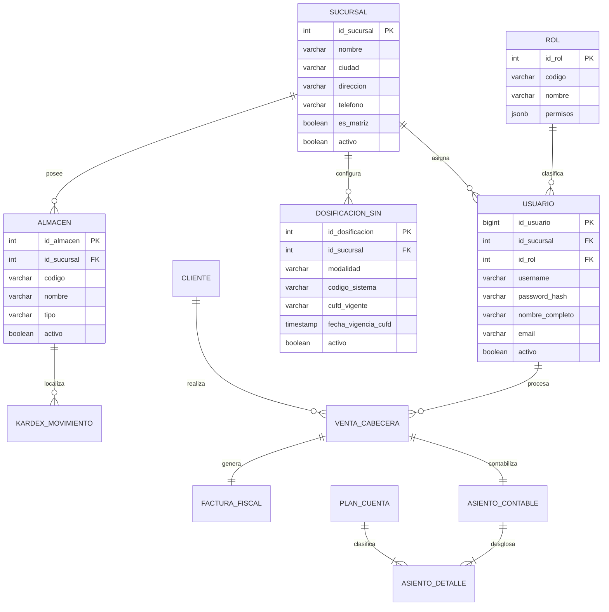

# Data Model: 001-setup-db-core

**Feature**: `001-setup-db-core`  
**Date**: 2026-09-23  
**Database**: PostgreSQL 16+  
**Status**: Formal Specification  

---

## 1. Entidades del Núcleo (Core Domain)

---

## 2. Diccionario de Datos DDL Detallado

### 2.1. Tabla `sucursales`
Representa los centros de operación física y comercial de DIREMOR S.R.L.

| Columna | Tipo | Nulo | Restricciones / Descripción |
| :--- | :--- | :--- | :--- |
| `id_sucursal` | `INT GENERATED ALWAYS AS IDENTITY` | NO | Clave Primaria. |
| `codigo` | `VARCHAR(10)` | NO | Código mnemotécnico único (ej. `SCZ-01`, `CBB-01`). |
| `nombre` | `VARCHAR(100)` | NO | Denominación legal de la sucursal. |
| `ciudad` | `VARCHAR(50)` | NO | Ciudad de radicación (Santa Cruz, Cochabamba, La Paz, etc.). |
| `direccion` | `VARCHAR(200)` | NO | Dirección fiscal de la sucursal. |
| `telefono` | `VARCHAR(30)` | SÍ | Teléfono de contacto. |
| `es_matriz` | `BOOLEAN` | NO | `TRUE` si es la Casa Matriz central. Default: `FALSE`. |
| `activo` | `BOOLEAN` | NO | Estado de operación. Default: `TRUE`. |
| `created_at` | `TIMESTAMPTZ` | NO | Fecha y hora de creación. |

### 2.2. Tabla `roles`
Catálogo de perfiles de usuario según el modelo RBAC.

| Columna | Tipo | Nulo | Restricciones / Descripción |
| :--- | :--- | :--- | :--- |
| `id_rol` | `INT GENERATED ALWAYS AS IDENTITY` | NO | Clave Primaria. |
| `codigo` | `VARCHAR(30)` | NO | Código de rol unívoco (`ADMIN`, `VENTAS_POS`, `ALMACEN`, `CONTABILIDAD`). |
| `nombre` | `VARCHAR(100)` | NO | Nombre legible del rol. |
| `permisos` | `JSONB` | NO | Arreglo JSON con permisos granulares (`["ventas.crear", "caja.arqueo"]`). |

### 2.3. Tabla `usuarios`
Personal operativo y directivo autorizado en el sistema SAC.

| Columna | Tipo | Nulo | Restricciones / Descripción |
| :--- | :--- | :--- | :--- |
| `id_usuario` | `BIGINT GENERATED ALWAYS AS IDENTITY` | NO | Clave Primaria. |
| `id_sucursal` | `INT` | NO | Llave foránea a `sucursales(id_sucursal)`. |
| `id_rol` | `INT` | NO | Llave foránea a `roles(id_rol)`. |
| `username` | `VARCHAR(50)` | NO | Identificador único de acceso al sistema. |
| `password_hash`| `VARCHAR(255)` | NO | Hash criptográfico de contraseña (Argon2id o bcrypt). |
| `nombre_completo`| `VARCHAR(150)`| NO | Nombres y apellidos del funcionario. |
| `email` | `VARCHAR(150)` | SÍ | Correo electrónico corporativo. |
| `activo` | `BOOLEAN` | NO | Estado de habilitación. Default: `TRUE`. |
| `ultimo_acceso`| `TIMESTAMPTZ` | SÍ | Registro del último login exitoso. |

### 2.4. Tabla `almacenes`
Bodegas físicas para guarda y despacho de mercaderías e insumos.

| Columna | Tipo | Nulo | Restricciones / Descripción |
| :--- | :--- | :--- | :--- |
| `id_almacen` | `INT GENERATED ALWAYS AS IDENTITY` | NO | Clave Primaria. |
| `id_sucursal` | `INT` | NO | Llave foránea a `sucursales(id_sucursal)`. |
| `codigo` | `VARCHAR(20)` | NO | Código interno (ej. `ALM-CENTRAL`, `ALM-PISO`). |
| `nombre` | `VARCHAR(100)` | NO | Nombre descriptivo de la bodega. |
| `tipo` | `VARCHAR(30)` | NO | `PRINCIPAL`, `VENTAS`, `TRANSITO`, `MERMA`, `CUARENTENA`. |
| `activo` | `BOOLEAN` | NO | Default: `TRUE`. |

### 2.5. Tabla `dosificaciones_sin`
Parámetros técnicos de facturación en línea exigidos por la RND 102100000011.

| Columna | Tipo | Nulo | Restricciones / Descripción |
| :--- | :--- | :--- | :--- |
| `id_dosificacion`| `INT GENERATED ALWAYS AS IDENTITY` | NO | Clave Primaria. |
| `id_sucursal` | `INT` | NO | Llave foránea a `sucursales(id_sucursal)`. |
| `modalidad` | `VARCHAR(30)` | NO | `ELECTRONICA_EN_LINEA` o `COMPUTARIZADA_EN_LINEA`. |
| `codigo_punto_venta`| `INT` | NO | Código de punto de venta registrado ante el SIN (0 para Casa Matriz). |
| `cufd_vigente` | `VARCHAR(120)` | SÍ | Código Único de Facturación Diaria activo. |
| `fecha_vigencia_cufd`| `TIMESTAMPTZ`| SÍ | Vencimiento del CUFD (máx. 24 horas según norma). |
| `activo` | `BOOLEAN` | NO | Default: `TRUE`. |

---

## 3. Integridad y Reglas Transaccionales
1. **Regla de Borrado Referencial:** `ON DELETE RESTRICT` en todas las llaves foráneas. Queda prohibida la eliminación en cascada en tablas core para proteger la historia auditable.
2. **Índices de Búsqueda Rápida:**
   * `idx_usuarios_username` sobre `usuarios(username)`.
   * `idx_almacenes_sucursal` sobre `almacenes(id_sucursal)`.
   * `idx_dosificaciones_sucursal` sobre `dosificaciones_sin(id_sucursal)` filtrado por `activo = TRUE`.
