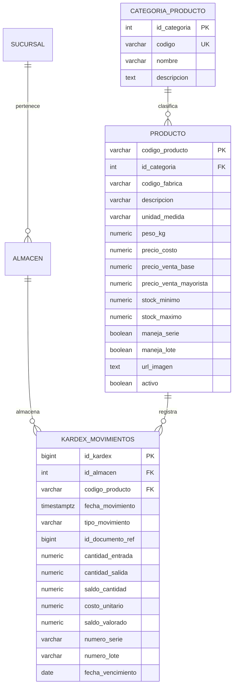

# Data Model: 002-productos-kardex

## Entidades y Relaciones

## Reglas de Integridad y Validación
1. `precio_costo >= 0`, `precio_venta_base >= 0`.
2. `saldo_cantidad`: Calculado acumulativamente; para movimientos de salida, si `saldo_cantidad - cantidad_salida < 0`, la transacción aborta con error `Stock insuficiente en almacén`.
3. `costo_unitario`: En compras o entradas manuales se suministra el costo del movimiento; en salidas se toma el costo promedio ponderado vigente (`saldo_valorado / saldo_cantidad`).
